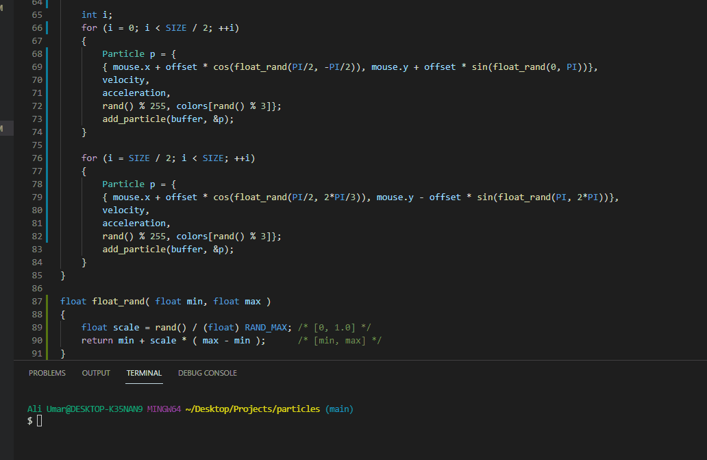
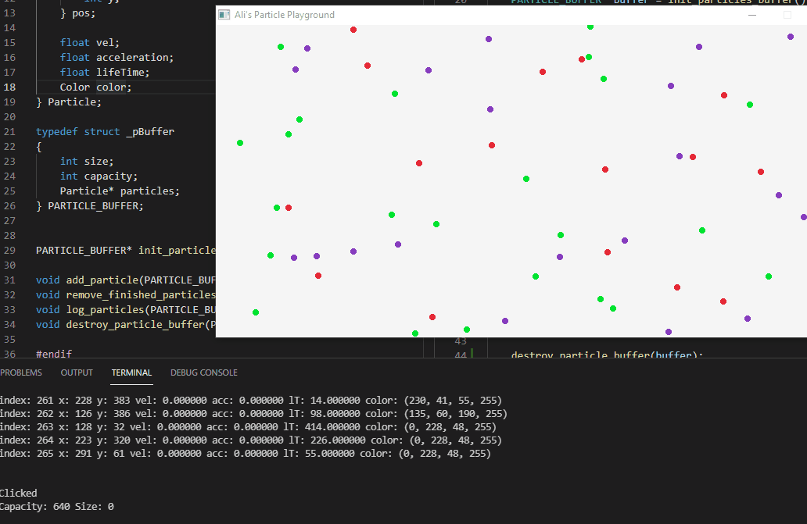

# particles-playground
## About
Hi, my name is Ali and i've been working on this on and off. It's really cool, check it out!. 

## Get started
Everything in this repo should be included to get this program up and running on Windows... however you will need MinGW GCC Compiler and a GNU Make port on your computer.

```
1. Git clone the repo
2. mkdir output
3. make run
4. Profit!
```

### Current state


### Previous progress




